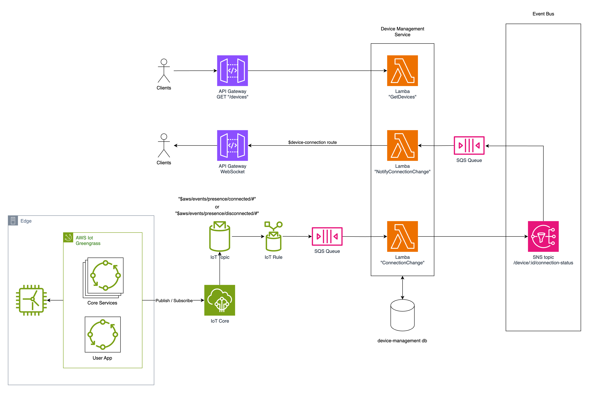

# IoT Case

This repository illustrates a scenario wherein an IoT device transmits its connection status to a cloud environment, which is then captured by a service optimized for rapid querying.

The aforementioned service exposes a Web API, enabling clients to retrieve a list of devices.

The architectural design prioritizes serverless deployment. Specifically, AWS is designated as the cloud provider. The deployment strategy is depicted in the diagram below:



## Local development

Given that the solution isn't yet deployed to AWS, mock environments are established to facilitate local execution.

A Docker Compose configuration defines the required services. Notably, a RabbitMQ instance serves as the "Event Bus," Eclipse Mosquitto is employed as a local MQTT broker, and an Express server hosts the API, facilitating seamless integration of all components.

### Try it out

Simple run it with the following command

```
cd src && docker compose -p iot-case up
```

When seeing `Device Management service listening on port 3000` go and open another terminal, and query for available devices:

```
curl --location 'localhost:6001/devices' | json_pp
```

where you should be able to see a device with the id `test-device` which is `disconnected`.

To mock a MQTT message saying the device is online you can install the `mqtt` command line tool:

```
npm install -g mqtt
```

and then publish the connection status of the `test-device`:

```
mqtt pub -t 'device/test-device/connection-status' -m '{"status": "connected"}'
```

When querying for devices, the connection status of the device should now be `connected`:

```
curl --location 'localhost:6001/devices' | json_pp
```
